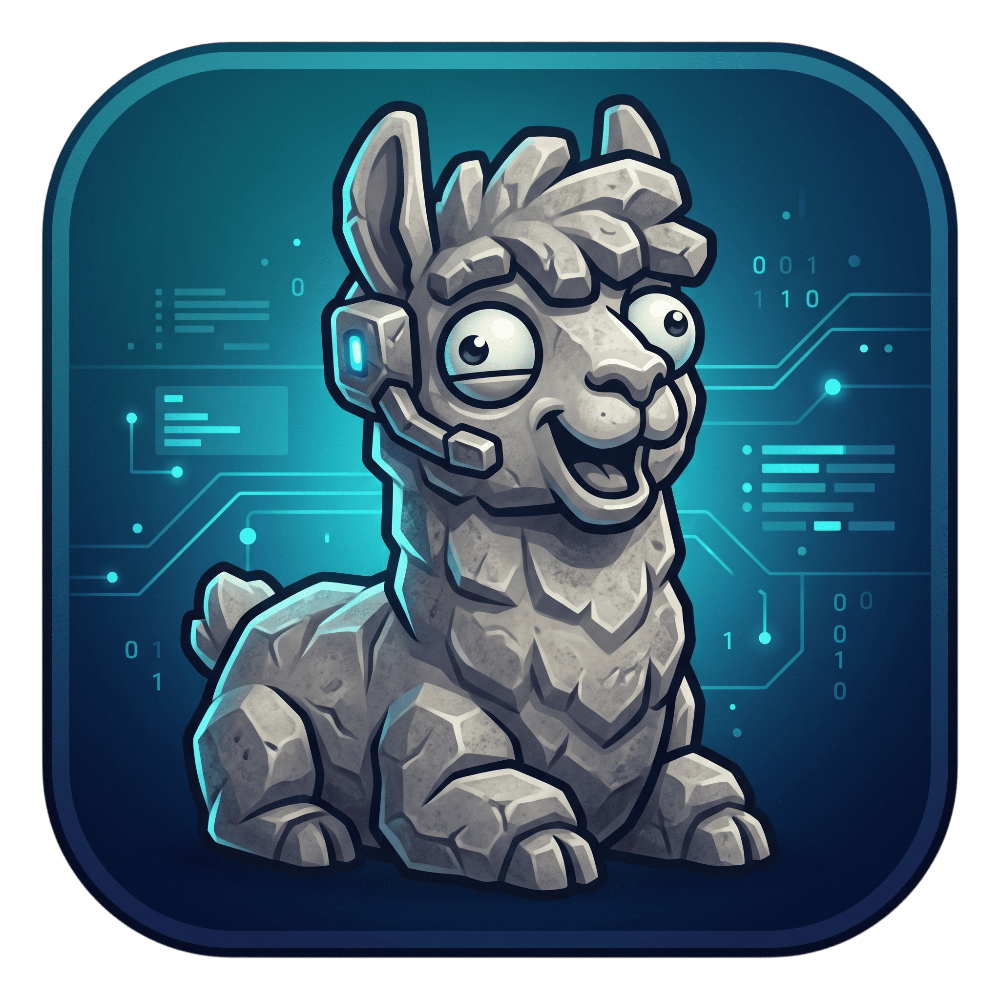

<div align="center">
  
</div>

# stone-llama

**Ollama-style CLI + local model server for ExLlamaV3 + TabbyAPI** — one small Go
binary that pulls EXL3 models, auto-fits context to your VRAM, and serves an
OpenAI-compatible API that any client or gateway can point at.

**[Website](https://rizperdana.github.io/stone-llama/) · [Install](#install) · [Quickstart](#quickstart) · [Commands](#commands)**

**Positioning:** on NVIDIA-only hardware, EXL3 gives faster decode and smaller KV caches
than GGUF/Q4. stone-llama's differentiator is **VRAM-aware auto-fit context** — it computes
a safe context window and cache mode from your GPU and the model's own `config.json` (and
warns when your picked config rides the prefill edge). It is *not* a better ollama: no
CPU/AMD/Apple support, no huge catalog. If that's your machine, use ollama with GGUF.

## Install

```bash
git clone https://github.com/rizperdana/stone-llama
cd stone-llama
go build -o stone-llama ./cmd/stone-llama   # Go ≥ 1.24
install -Dm755 stone-llama ~/.local/bin/stone-llama
```

or, once a release is tagged, install a sha256-verified binary:

```bash
curl -fsSL https://raw.githubusercontent.com/rizperdana/stone-llama/main/scripts/install.sh | sh
```

`setup` provisions the pinned Python/torch runtime next — consent-gated, ~1 GB announced
before you confirm. Full prerequisites, install paths, uninstall:
[docs/INSTALLATION.md](docs/INSTALLATION.md).

## Quickstart

```bash
stone-llama doctor                       # GPU + driver check, picks cu12/cu13 — no downloads
stone-llama setup                        # Python/torch runtime; announces sizes, asks before any byte
stone-llama fit async0x42/Qwen3-1.7B-exl3_4.0bpw   # gate + tok/s estimate from HF metadata — no download
stone-llama pull async0x42/Qwen3-1.7B-exl3_4.0bpw  # gate runs first, then resumable download
stone-llama run Qwen3-1.7B-exl3_4.0bpw   # CLI chat (prints the autofit decision)
stone-llama serve                        # OpenAI-compatible API on 127.0.0.1:5111
```

```bash
curl http://127.0.0.1:5111/v1/chat/completions -d '{
  "model": "Qwen3-1.7B-exl3_4.0bpw",
  "messages": [{"role": "user", "content": "hello"}]
}'
```

Step-by-step with expected output: [docs/QUICKSTART.md](docs/QUICKSTART.md).
Handing this to a coding agent? Use [docs/AGENT-SETUP.md](docs/AGENT-SETUP.md).

> Model repos on the Hub churn — quant converters routinely delete or move weights, so
> `pull` runs the pre-download gate (arch / quant / fit, from metadata) **before** any byte
> moves, and `import` can bind a model dir you already own instead of trusting the Hub.

## Platform reality — NVIDIA/CUDA only, read this first

exllamav3 — the engine this binary wraps — has **no CPU, AMD/ROCm, or Apple/Metal path**.
That is not configurable:

| Machine | Works? |
|---|---|
| NVIDIA GPU, Linux x86_64, driver ≥ 570 | ✅ (runtime extra `cu12`) |
| NVIDIA GPU, Linux x86_64, driver ≥ 580 | ✅ (runtime extra `cu13`) |
| NVIDIA GPU, driver < 570 | ❌ upgrade the driver |
| AMD / Intel GPU | ❌ |
| CPU-only machine | ❌ |
| Apple Silicon / macOS | ❌ can run `doctor`/`list`/`fit`, can **never serve** |
| Windows | ⚠️ binary published but **untested at runtime** |
| Linux arm64 | ❌ not v1 |

**Linux/amd64 + NVIDIA CUDA is the only supported v1 platform.** On CPU/AMD/Apple, use
ollama with GGUF. `stone-llama doctor` prints this verdict — with your actual GPU and driver
numbers — before anything is installed.

## Commands

| Command | Description | Status |
|---|---|---|
| `stone-llama doctor` | GPU/driver/runtime verdict, no changes made | ✅ shipped |
| `stone-llama fit <repo>` | gate + predicted tok/s from HF metadata — **no model download** | ✅ shipped |
| `stone-llama list [--estimate]` | models, size, quant, gate verdict, source (+ tok/s estimates) | ✅ shipped |
| `stone-llama rank --collection <owner/name>` | rank a HF collection by fit + predicted tok/s (also `--file`, `--ratings`) | ✅ shipped |
| `stone-llama import <dir> [--name <n>]` | symlink an existing model dir in (zero copy; name defaults to dir) | ✅ shipped |
| `stone-llama rm <model>` | remove a model (import links drop the link only) | ✅ shipped |
| `stone-llama pull <model>[:tag]` | pre-download gate → consent → resumable download + sha256 verify | ✅ shipped |
| `stone-llama login` | HuggingFace token for gated repos (stored 0600) | ✅ shipped |
| `stone-llama setup [--yes] [--cu12\|--cu13]` | provision the pinned Python runtime (consent-gated; extra from driver unless overridden) | ✅ shipped |
| `stone-llama serve [--attach host:port]` | daemon: OpenAI-compatible API (attach = existing TabbyAPI upstream) | 🚧 M5 |
| `stone-llama ps` | loaded model + live VRAM | 🚧 M5 |
| `stone-llama stop` | stop the daemon | 🚧 M5 |
| `stone-llama run <model>` | streaming CLI chat | 🚧 M6 |
| `stone-llama version` | version | ✅ shipped |

Flags that always win over autofit: `--ctx N`, `--cache-mode Q8|Q4|FP16|"2,2"`,
`--no-autofit`. Env: `STONE_LLAMA_HOST`, `STONE_LLAMA_PORT`, `STONE_LLAMA_MODELS_DIR`,
`STONE_LLAMA_CONFIG`, `STONE_LLAMA_NO_AUTOSTART`, `HF_TOKEN`.

## How autofit picks your context

From the model's `config.json` plus your VRAM only:

```
head_dim  = hidden_size / num_attention_heads                    # 2048/16 = 128
elems/tok = num_hidden_layers × 2 × num_key_value_heads × head_dim
load_mib    = weights_mib + ctx × elems/tok × bytes_per_element/2²⁰ + 128   # fixed overhead
headroom_mib(ctx) = 512 base + 512 prefill workspace [est] + 512 × ctx/65536 [est]
fits        ⟺ load_mib ≤ vram_total_mib − headroom_mib(ctx)
```

Cache cost per token: **FP16 2 B, Q8 1 B, Q4 0.5 B per element.** The ladder tries `ctx =
trained max`, then halves it down to 4096, preferring better cache quality at each tier
(FP16 → Q8 → Q4). Guardrails: never exceeds `max_position_embeddings`; `--ctx` /
`--cache-mode` bypass the ladder; the decision and its arithmetic are **always printed**.
Full derivation + live measurements: [docs/ARCHITECTURE.md](docs/ARCHITECTURE.md).

Worked example on an RTX 3050 Laptop (4096 MiB) with `SmolLM3-3B-exl3`
(36 × 2 × 4 × 128 = **36,864 elems/token**):

| Config | KV @ ctx | headroom(ctx) | Total (1866 weights + 128) | Fits? |
|---|---|---|---|---|
| FP16 @ 65536 | 4608 MiB | 1536 | 6602 MiB | ❌ |
| Q8 @ 65536 | 2304 MiB | 1536 | 4298 MiB | ❌ |
| Q4 @ 65536 | 1152 MiB | 1536 | 3146 MiB | ❌ (4682 > 4096) |
| **Q4 @ 32768** | **576 MiB** | **1280** | **2570 MiB** | ✅ → picks Q4 @ 32768 |

(Q4 @ 65536 measured 3105 MiB live — it serves, but prefill-OOMs on a used card, so the
ladder defaults to 32768.) The OOM a 4 GB card actually hits is in **prefill** (a cublas/
hgemm workspace allocates *before* the first token), so `max_tokens` won't save you — drop
`--ctx` one tier (32768 → 16384) on a prefill OOM. Q4 @ 65536 is the max-context option
(print its cost); the ladder default is the safe context.

The capture below is the signature illustration — gate, tok/s estimate, an oversized
refusal, and `rank` — all from metadata, **no download**. It is verbatim from a live run
(2026-09-26, RTX 3050 Laptop, 4096 MiB, driver 580.178.04). Raw captures:
[docs/screenshots/](docs/screenshots/).

```console
$ stone-llama fit async0x42/Qwen3-1.7B-exl3_4.0bpw      # metadata only — no download
gate: arch  ✓ Qwen3ForCausalLM
gate: quant ✓ exl3
gate: fit   ⚠ weights 1491 + KV 1120 + overhead 128 = 2739 MiB (headroom 1344, budget 2752)
      warning: only 13 MiB margin above the 1344 MiB headroom (prefill workspace [est] included): multi-KB prompts can OOM during prefill on a used card — if you see CUDA OOM before the first token, drop --ctx
estimate: ~31 tok/s decode, ~582 tok/s prefill [est] at Q4 ctx 40960 (NVIDIA GeForce RTX 3050 Laptop GPU) — low confidence, anchored to the measured 42.7 tok/s SmolLM3-3B 3.5bpw point (1866 MiB) on this GPU; calibration pending

$ stone-llama fit async0x42/Qwen3-8B-exl3_4.0bpw        # too big for 4 GB
gate: arch  ✓ Qwen3ForCausalLM
gate: quant ✓ exl3
gate: fit   ✗ no config fits: weights 4950 + KV (Q4 @ 4096) 144 + overhead 128 = 5222 MiB > 3040 MiB budget (4096 MiB VRAM − 1056 headroom: 512 base + 512 prefill workspace [est] + 32 ctx margin [est])
      largest ctx that would fit: none — no context fits; pull a smaller quant or use a bigger GPU
      reduce --ctx or pick a smaller quant
fit: refused — no context fits this model in VRAM (see the gate report above)
# fit exits 3 when refused

$ stone-llama rank --file refs.txt                          # two HF refs, metadata only
REPO                              QUANT  VERDICT        EST T/S  EST PRE T/S  RATING
async0x42/Qwen3-1.7B-exl3_4.0bpw  4bpw   warn:40960 Q4  31       582          -
async0x42/Qwen3-8B-exl3_4.0bpw    4bpw   refuse         -        -            -
~ values are estimates [est] from metadata + GPU spec — not measured (calibration pending)
```

## The pre-download fit gate

`fit` (and the same gate inside `pull`) reads small metadata first (`config.json`,
`quantization_config.json`, file tree — KB, not weights) and checks three things **before**
a single weight byte moves:

1. **Architecture** — `config.architectures[]` must be one exllamav3 supports (reconciled
   from `architecture/*.py`); unknown → warned with the exact string, never silently
   accepted.
2. **Quant format** — `quant_method` must be `exl3`. `exl2` (ExLlamaV2 format, guaranteed
   load failure) → refused. GGUF-only repo → refused ("use ollama with GGUF").
3. **Fit** — the autofit math above, against *your* GPU: proceed, proceed-with-warning, or
   refuse — with numbers and the largest fitting ctx either way.

The verdict is saved to the model's `manifest.json` and shown by `stone-llama list`.
**Cost of a catch: ~2 KB of metadata instead of a wasted multi-GB download** — that's why a
2 GB pull never starts for a model that doesn't fit. `pull` runs this gate before any byte
moves; a non-interactive run (piped stdin, no `--yes`) is refused up front, with no consent
prompt shown — the piped answer is never read ([gate.txt](docs/screenshots/gate.txt)).
Full design: [docs/ARCHITECTURE.md](docs/ARCHITECTURE.md).

`fit` also prints a predicted tok/s **[est]** from HF metadata — no weights on disk needed,
so you can `rank` candidates before committing bandwidth. The estimator's decode constant
is ≈83.6 GB/s effective bandwidth on this GPU — `decodeEfficiency` (0.373) × the RTX 3050
Laptop's 224 GB/s spec — calibrated to the measured 42.7 tok/s SmolLM3-3B 3.5bpw anchor
(1866 MiB). A predicted tok/s is **relative to the chosen context** (larger ctx streams more
KV bytes per token, lowering decode speed), so two configs quoted at different contexts
aren't directly comparable. Calibration pending.

## Storage

```
~/.config/stone-llama/config.json       # config (no secrets)
~/.local/share/stone-llama/
├── models/<model>/                     # TabbyAPI-shaped dirs + manifest.json
├── runtime/                            # uv + Python + venv + pinned TabbyAPI
├── logs/                               # daemon.log, tabby.log, setup.log
└── hf_token                            # 0600, only after `stone-llama login`
```

## Third-party components

stone-llama **redistributes none** of them; `setup` fetches each from its upstream source
on your machine, with sizes announced and your confirmation required. Licenses verified
(detail + evidence in [THIRD-PARTY.md](THIRD-PARTY.md)):

| Component | How it arrives | License |
|---|---|---|
| uv | upstream release binary, SHA-256 verified | Apache-2.0 **OR** MIT (dual) |
| CPython 3.12 | `uv python install` (python-build-standalone) | PSF-2.0 |
| PyTorch (+cu130) | pinned wheel from lock file | BSD-3-Clause |
| exllamav3 | pinned wheel from lock file | MIT |
| Triton | pinned wheel from lock file | MIT |
| Flash-linear-attention | pinned wheel from lock file | MIT |
| NVIDIA CUDA/cuDNN (18 wheels) | transitive deps of the `+cu130` torch wheel, pinned in lock file | Proprietary — NVIDIA EULA |
| TabbyAPI (`f07131cd`) | `git clone` + pinned checkout | **AGPL-3.0** |

The NVIDIA CUDA/cuDNN wheels — all `nvidia-*` plus `cuda-toolkit`, `cuda-bindings`, and
`cuda-pathfinder` — are **not** open source: they ship NVIDIA's proprietary EULA, and the
user accepts those terms directly at `setup` time (sizes announced, one consent prompt).
The lone exception is `nvidia-nvtx` (Apache-2.0 with LLVM exceptions). The full pinned set,
versions, and per-package evidence are in [THIRD-PARTY.md](THIRD-PARTY.md).

**AGPL note:** we neither distribute nor modify TabbyAPI — `setup` downloads upstream
sources to your disk at your request, and stone-llama talks to it as a separate process
over HTTP. Vendoring or shipping a patched TabbyAPI fork is a deliberate non-goal.

## Out of scope for v1

- Windows, macOS, arm64 support claims (Linux x86_64 is the only supported platform; a
  Windows binary may be published but is untested; macOS can never serve)
- CPU/AMD/Apple inference (impossible — see above)
- Multi-GPU `gpu_split` autofit (single GPU; TabbyAPI autosplit passes through)
- Concurrent multi-model serving (one loaded model at a time, like ollama today)
- GGUF, EXL2, draft/speculative models
- Forking or vendoring TabbyAPI (AGPL — see above)

## Documentation

| Doc | What's in it |
|---|---|
| [Website](https://rizperdana.github.io/stone-llama/) | project homepage — rendered site with a model compatibility table (fits + predicted tok/s per model for a 4 GB card) |
| [docs/INSTALLATION.md](docs/INSTALLATION.md) | prerequisites, install paths, `setup` provisioning, uninstall |
| [docs/QUICKSTART.md](docs/QUICKSTART.md) | first-run walkthrough with real output |
| [docs/AGENT-SETUP.md](docs/AGENT-SETUP.md) | copy-paste prompt for a coding agent |
| [docs/ARCHITECTURE.md](docs/ARCHITECTURE.md) | full plan, milestones, open gaps |

## Development

Zero-download test suite: autofit math is table-tested on fixture `config.json` files, the
gate and downloader run against an in-process fake HuggingFace server, and the proxy/daemon
against a fake TabbyAPI — CI needs no GPU, no Python, no model weights.

## License

MIT — see [LICENSE](LICENSE). Third-party runtime components: see
[THIRD-PARTY.md](THIRD-PARTY.md).
